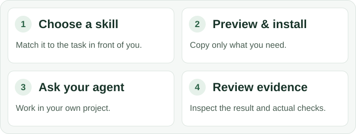

# yet-more-skills

**Practical skills for coding agents. Focused help for real engineering work.**

[Quick start](#quick-start) · [Choose your skills](#choose-your-skills) · [Examples](#try-it-on-a-real-task) · [Contributing](#contributing)

Give your coding agent a reusable playbook for the work in front of it: a Rust lifecycle bug, a Python package, a TypeScript contract, an accessible UI, or a clearer handoff. Pick what helps, adapt it to your project, and leave the rest on the shelf.

This collection contains **[82 focused skills](catalog.json)** across Rust, Python/PyO3, TypeScript, UI/UX, and **agent experience (AX)**: tools, context, and workflows that are easier for agents to use well. Skills are readable Markdown with optional references and scripts—not a new agent framework to adopt.



## Quick start

You need **Python 3.11+** for the installer and a coding agent that supports skill folders. The installer uses only Python's standard library; no additional Python packages are needed to browse or copy skills. The examples use Git and `python3`; substitute your Python 3.11+ executable as needed.

### 1. Get the collection

```sh
git clone https://github.com/jscott3201/yet-more-skills.git
cd yet-more-skills
```

### 2. Pick a small starting set

`workflow-lite` is a five-skill starting point for repository orientation, research, diagnosis, scoping, and handoffs. Browse the descriptions, inspect any skill that interests you, then preview the copy:

```sh
python3 install.py --list --set workflow-lite
python3 install.py --set workflow-lite
```

The second command prints the planned destinations and `Preview only: 5 skills`. **Nothing is copied until you add `--apply`.**

```sh
python3 install.py --set workflow-lite --apply
```

This copies the selected folders to `~/.agents/skills`, the installer's default **user-level** location. Prefer project-only skills? Use `--dest /path/to/your-project/.agents/skills` for both preview and apply instead. Existing skill names are never overwritten; see [updating installed skills](docs/installation.md#updating-installed-skills) when a destination is already populated.

### 3. Use one on a real task

Open your coding agent in **the project you want to work on**, not in this skills repository. In Codex CLI or the IDE extension, use `/skills` to find an installed skill or mention it in your prompt:

```text
Use $diagnosis-loop to investigate this failing test. Start with the affected
code, identify the cause, and explain the smallest fix. Do not edit files yet.
```

That skill is included in `workflow-lite`. See [compatibility](#compatibility) for discovery details and other agents.

## Choose your skills

**Install for the work you do, then invoke for the task at hand.** A set is a convenient selection of independent skills, not a requirement to load every one of them.

| Your work | A useful starting point | What it covers |
| --- | --- | --- |
| Rust libraries and services | `core` | API design, nextest, behavioral tests, performance, and review |
| Python packages and applications | `python-core` | APIs and typing, pytest, test design, performance, and review |
| Rust ↔ Python bindings | `bindings` | PyO3 ownership, async lifecycles, free-threading, buffers, and wheels |
| React or Svelte applications | `react-ui` or `svelte-ui` | Framework-specific components, shadcn, state, accessibility, and browser checks |
| TypeScript libraries and SDKs | `typescript-packages` | Contracts, exports, declarations, and external package consumers |
| Agent tools and collaborative interfaces | `agent-experience` | Tool boundaries, memory, CLI design, and human-agent collaboration |
| Excessive context or repeated exploration | `--skill context-efficiency` | Scoped retrieval, bounded output, useful delegation, and stopping rules |

Browse by topic, or select a single skill:

```sh
python3 install.py --list --search 'rust async' --limit 5
python3 install.py --list --set python --search 'packaging' --json
python3 install.py --skill ui-accessibility
```

The last command previews one skill; add `--apply` to copy it. `--skill` can be repeated or combined with one `--set`, and duplicates in that selection are removed.

See the **[installation guide](docs/installation.md)** for every set, project-only installation, CLI options, and updating customized copies. The [catalog](catalog.json) contains every description and invocation policy; the [skill folders](skills) contain the instructions themselves.

## Try it on a real task

After installing the named skill, give it the relevant task, paths, and boundaries. These examples are prompts for your agent, not shell commands.

**Review a Rust cancellation path** with `rust-async-concurrency`:

```text
Use $rust-async-concurrency to review this worker's shutdown path.
Check who owns spawned tasks after a timeout and how cleanup is observed.
Review only; do not change the runtime or edit files.
```

**Improve an existing interface** with `ui-design-review`:

```text
Use $ui-design-review to improve this settings screen. Keep our existing
shadcn components and design tokens. Include loading, error, and narrow-layout
states, and distinguish source review from actual browser validation.
```

**Keep a fix focused** with `context-efficiency`:

```text
Use $context-efficiency while fixing this bug. Start with the named function
and its regression test, reuse established context, and expand only when
the evidence calls for it. Keep all required checks.
```

The catalog also covers cross-language contracts, graph editors, large data tables, and equipment visualization. A single agent can use these skills; orchestration is optional.

## What to expect

**Specific guidance, not a replacement for judgment.** The skills emphasize observable behavior, useful tests, real source evidence, and preserving the project's existing tools and conventions. UI guidance distinguishes React from Svelte and treats accessibility as part of the interaction.

**Less unnecessary work, not less verification.** Context-efficiency guidance starts from the relevant code and question rather than a whole-repository survey. Optional references provide depth when needed. It does not authorize skipping tests or silently narrowing a requested deep review. See the [practical recipes](skills/context-efficiency/references/recipes.md) and [research notes](skills/context-efficiency/references/research.md).

**You remain in control.** The installer copies skill folders and license files. It does not configure your agent, install model runtimes or MCP servers, or grant permission to commit, publish, deploy, or operate equipment. Review instructions and scripts as you would other third-party code; your permissions and repository policy remain authoritative.

This is an evolving collection. Packaging tests and metadata checks are separate from agent-quality evaluations. The [evaluation guide](evals/README.md) and [validation notes](evals/context-efficiency-checks.md) distinguish structural checks from model evaluations. No measured end-to-end token savings or universal runtime compatibility is claimed.

## Compatibility

These folders follow the [Agent Skills format](https://agentskills.io/specification), with Codex-specific display and invocation metadata in `agents/openai.yaml`.

**Codex CLI and IDE extension:** the quick start uses local skill folders. Codex supports user-level `~/.agents/skills` and repository `.agents/skills` locations. It can select matching skills automatically; skills marked `[explicit-only]` in the listing need an explicit request. See the [official skills documentation](https://developers.openai.com/codex/skills) for discovery and invocation behavior. This repository is distributed as folders, not a plugin installer.

**Other skill-capable agents:** use that host's documented skill location and loading method. The Markdown is available to adapt, but a host may ignore `agents/openai.yaml`, including explicit-only policy. A portable file format is not a claim that every host has been tested. No particular model, optional memory service, or orchestration framework is required by this collection.

## Contributing

Found a confusing instruction, an outdated API assumption, or a task where an agent did too much work? **[Open an issue](https://github.com/jscott3201/yet-more-skills/issues) or [send a pull request](https://github.com/jscott3201/yet-more-skills/pulls).** Small corrections, clearer examples, and reports from real use are welcome—not just new skills.

For a report, include the skill, agent/host, task, expected behavior, and actual result. Keep examples small and remove private information.

For a change, improve an existing skill when it serves the same task. Keep triggers clear, optional depth in references, and attribution intact. Keep the catalog, agent metadata, and any affected selections/tests aligned. Include a realistic use case, a nearby non-trigger, and a meaningful failure case; report which you actually ran.

Run the checks relevant to your change from the repository root:

```sh
python3 -m unittest discover -s tests -v
# The following authoring checks require PyYAML in your development environment:
python3 tools/validate_metadata.py
python3 -m unittest discover -s tools -p 'test_*.py' -v
```

The [skill-authoring guidance](skills/cross-platform-agent-instructions/SKILL.md) and [evaluation guide](evals/README.md) offer more detail. Clear notes about what changed and what you checked are enough; no elaborate proposal is needed for a small improvement.

## License and thanks

Original work is available under **[MIT](LICENSE-MIT) or [Apache-2.0](LICENSE-APACHE)**, at your option. Retain the applicable license and attribution notices when redistributing skills.

Seven workflow adaptations include upstream MIT notices from [Matt Pocock's skills](https://github.com/mattpocock/skills); those notices remain with the relevant folders. Thanks to the wider skills community for sharing ideas, examples, and lessons from real agent workflows.

**Try a skill on a real task, make it your own, and share what you learn.**
